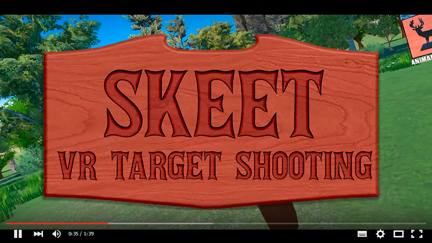

# Skeet: VR Target Shooting

```Note: This is the Skeet Public Repository and thus does not contain a full set of project files```

 Skeet: VR Target Shooting has been downloaded by nearly 150,000 gamers. It is a free game, which was updated to double the available content and to include 'Thank the Devs' minor cosmetic DLC at various price tiers.

[Video Playthrough](https://www.youtube.com/watch?v=fEheZHxzO0Q):
[](https://www.youtube.com/watch?v=fEheZHxzO0Q "Skeet: VR Target Shooting")

[Example reviewer playthrough](https://www.youtube.com/watch?v=ib3PbClMrbk)

[Link to Steam page](https://store.steampowered.com/app/446770/Skeet_VR_Target_Shooting/)

Valve granted Flatbox Studios prototypes of their Vive virtual reality headset approximately one month before the product was available to consumers, which enabled us to complete a project the rough size of a game jam game. In 2016 the VR gaming industry space was very small. Fun, free experiences had a lot of space to be recognized. After Skeet's success, we were able to attend Steam Dev Days in Seattle, and met a number of industry leads. Discussions with Oculus led to the team being granted Rift hardware, and we immediately began work on an update to the game to add content and support for the Oculus Rift.

This project featured many technical challenges which had to be overcome in a tight deadline. Some notable examples:

* Object Pooling - Constructing many objects simultaneously can cause resource issues. It is far more efficient to hide and reset each object after it has shattered. As an example: after a bottle has shattered, we simply reset the pieces and hide the object. Whenever a new bottle is needed, before instantiating a new bottle we instead check to see if an existing one is ready in the Object Pool.

* Shattering Objects - Initially object shattering was handled procedurally. It was resource-intensive, and we found randomizing the position of pre-rendered shattered models was far more optimal. Along with Object Pooling, these improvements enabled us to shatter many objects simultaneously without an impact to performance.

* Bullet Collision - For more 'arcadey' gameplay, it didn't make sense to simulate a real projectile bullet. Instead, each gun has a slightly different collision cone which detects and immediately hits targets.

* Guns - Each gun features different gameplay or controls. This feature recieved a number of passes to ensure each gun felt intuitive to use.

* Steam Leaderboards - Every gun and game mode has its own local and global leaderboard through the Steamworks API. We also use the player's friend list to offer a meaningful competitive leaderboard.